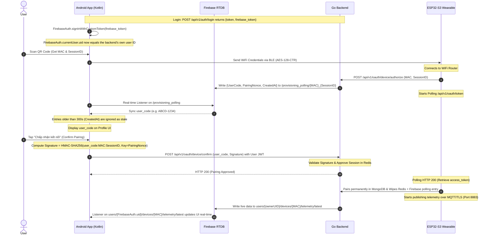

# Medical AI Chatbot (Sức Khỏe Việt AI)

A modern Android application providing AI-powered medical consultation and health companionship.

---

## 🚀 User Trial Guide

To experience all features of **Sức Khỏe Việt AI**, users can follow these steps:

1. **Onboarding**: Go through the onboarding screens to understand the core value of the application.
2. **Registration / Login**: Create a personal account (credentials are securely stored in the local database).
3. **AI Consultation**:
   - In the home screen, choose from **Suggested Questions** (e.g. "I have a headache and fever") or type symptoms directly.
   - Use the **Quick Replies** above the input bar to interact swiftly with the AI assistant.
4. **Triage Assessment & Classification**:
   - Observe color-coded urgency tags: **Green** (Home care), **Yellow** (Consult a doctor), **Red** (Emergency care).
   - Tap "Analysis by AI" to inspect predicted clinical details and symptoms.
5. **History Management**: Review previous threads in the **History** tab.
6. **Nearby Medical Facilities**: Use the map feature to locate the nearest hospitals, clinics, or pharmacies.

---

## ✨ Key Features

- **🤖 Smart AI Assistant:** Medical consultation powered by Google's Gemini AI (Firebase AI) providing natural, in-depth clinical advice.
- **🏥 Automated Triage Tagging:** Evaluates symptom urgency based on clinical protocols.
- **📋 Medical Record Summary:** Automatically summarizes dialog history so patients can easily present it to doctors.
- **📂 Consult History Management:** Stores health logs for users and their dependents.
- **📍 Location-based Map:** Integrates Google Maps/Location API to search for clinics, hospitals, and drugstores.
- **📱 Responsive UI/UX:** Built entirely with Jetpack Compose following Material 3 guidelines, fully adaptive across various screen sizes.

---

## 🏗️ Architecture: Clean Architecture + MVVM

The project is structured according to **Clean Architecture** principles combined with **MVVM** to ensure modularity, scalability, and testability.

### 1. Presentation Layer (UI & ViewModel)
- **Framework:** Jetpack Compose (Material 3).
- **Navigation:** Type-safe Compose Navigation.
- **State Management:** viewModels exposing StateFlows for reactive UI rendering.

### 2. Domain Layer (Business Logic)
- **Entities:** Core models such as `ChatThread`, `UserProfile`, `TriageTag`, and `IoTData`.
- **Use Cases:** Encapsulates business actions like `SendMessageUseCase`.

### 3. Data Layer (Implementation)
- **Repositories:** Coordinates data from Room (local cache), Firebase AI (Gemini), and Location services.
- **Data Sources:** Local Room Database, remote Firebase RTDB, and BleIoT Service.

---

## 📂 Directory Structure

```text
app/src/main/java/edu/hust/medicalaichatbot/
├── data/               # Data Layer (Repositories, Room DAOs, BLE services)
├── domain/             # Domain Layer (Business Entities & Use Cases)
├── ui/                 # Presentation Layer (Compose UI, ViewModels, Theme)
└── utils/              # Common Utilities & Constants
```

---

## 🛠️ Tech Stack

- **Language:** Kotlin 2.0+
- **UI Framework:** Jetpack Compose (Material 3)
- **Architecture:** Clean Architecture + MVVM
- **Database:** Room (with Paging 3 support)
- **AI Integration:** Firebase AI (Gemini API)
- **Networking:** Standard `java.net.HttpURLConnection` running in Coroutines (`Dispatchers.IO`)
- **IoT Provisioning:** Espressif BLE Provisioning SDK for Android
- **Event Bus:** GreenRobot EventBus
- **JVM Target:** 21

---

## ⚙️ Setup Requirements

- Android Studio Ladybug or newer.
- JDK 21.
- Firebase project with Gemini AI enabled.
- `google-services.json` placed in the `app/` directory.

---

## 🔗 Secure IoT Device Pairing (RFC 8628 Flow)

The application includes a secure device flow confirmation feature to pair hardware wearables (like the ESP32-S3 band) securely.

### Sequence Diagram



### Flow Breakdown

0. **Login & Firebase Identity:** On login, the Go backend returns both its own JWT (`token`) and a Firebase Auth **custom token** (`firebase_token`) minted with `uid` set to the backend's own user ID. The app calls `FirebaseAuth.signInWithCustomToken(firebase_token)`, which makes `FirebaseAuth.currentUser.uid` equal that same ID. This step is required: RTDB's security rules gate reads on `auth.uid === $uid`, and both the telemetry listener path and the rule check depend on the Firebase Auth UID matching the backend's own user ID — a plain anonymous sign-in (a random, unrelated UID) will build a path that never has any data and would be denied by the rules even if it did.
1. **BLE Setup:** The user scans the QR code on the physical band to capture the MAC address and session parameters. The phone connects locally via BLE (protected by Diffie-Hellman ECDH key agreement and AES-128-CTR) and transfers WiFi credentials.
2. **Device Registration:** The ESP32 joins WiFi and sends an authorization request to the Go backend, which inserts the session status (`authorization_pending`) into Redis and publishes a 4-letter user code (plus a `CreatedAt` timestamp) to Firebase RTDB.
3. **App Confirmation:** The Android app listens to Firebase RTDB's `provisioning_polling` node, ignores any entry older than 300 seconds (a session that's already expired server-side but wasn't cleaned up), and presents a confirmation card on the **Profile** screen for anything still live.
4. **Cryptographic Validation:** Clicking "Confirm" initiates a secure POST request to the Go Backend containing the HMAC-SHA256 signature calculated using that session's dynamic `PairingNonce` (from Firebase) as the secret key, authenticated via the user's JWT.
5. **Completion:** Go Backend updates the pairing state to approved in Redis. The ESP32 retrieves its permanent access token over HTTP, and the backend deletes both the Redis session and the Firebase polling entry. The ESP32 then starts streaming telemetry over MQTT/TLS, which the backend relays to `users/{ownerUID}/devices/{mac}/telemetry/latest` in Firebase RTDB, synced to the app's real-time charts via the listener set up in step 0.

---

## 🧪 E2E Verification & Debugging Guide

To verify the end-to-end flow from the Go Backend and ESP32 Firmware to the Android App, follow these steps:

### 1. Run the Backend Stack
Ensure your Docker containers are active:
```bash
cd iot-backend
docker compose up -d
```

### 2. Run the ESP32 Wearable Firmware
- Set the backend URL IP address inside `src/main.cpp` (in the firmware repo) to `192.168.1.41` and configure `local.properties` in this repo to `BACKEND_URL=http://192.168.1.41:8080`.
- Flash the firmware onto the board using `pio run --target upload`.
- Monitor execution logs using the PlatformIO serial monitor (`pio device monitor` at `115200` baud).

### 3. Setup WiFi & Observation in the App
- In the Android app, navigate to the **Profile** screen.
- Log in to your user profile.
- Tap **KẾT NỐI BLE** (Connect BLE), select the device, fill in the WiFi credentials, and tap **Gửi cấu hình** (Send Config).
- Wait for the yellow **Device Pairing Request** card to automatically pop up on the **Profile** screen (synced over IP `192.168.1.41` to Firebase).
- Tap **Chấp nhận kết nối** (Confirm Pairing) and observe real-time health data streaming!

### 🔍 Logcat Debugging Filter
Filter the Android Studio Logcat messages with the tag:
```text
tag:IoT_Pairing_Flow
```

Key log entries to check:
- `Firebase Sync: Discovered MAC=..., UserCode=XXXX-1111, PairingNonce=..., for session=session_xxxx`
- `User clicked Confirm Pairing. UserCode=XXXX-1111, MAC=..., Session=...`
- `Step 1: Authenticating user with Backend Go...` (skipped if a stored JWT already exists)
- `Authentication successful. Using JWT Token: ...`
- `Step 2: Computing HMAC-SHA256 signature using secret '<PairingNonce>'`
- `Step 3: Sending confirmation request to Backend Go...`
- `Ghép đôi thành công! Device pairing approved by backend.`

Also check tag `IoTViewModel` for `Auto-sync telemetry active for path: users/{uid}/devices/{mac}` — `{uid}` **must** match your backend user ID (the `uid_user` claim in your JWT), not a random Firebase-style anonymous ID. If it doesn't match, telemetry will never appear even though pairing succeeds; check tag `FirebaseAuth` for `Notifying id token listeners about user (...)` to see what UID is actually signed in.

> **Note:** the `firebase_token`/`signInWithCustomToken` exchange only runs on an explicit call to `/api/v1/auth/login` — restoring a session from local storage on app relaunch does **not** re-run it. If you're upgrading from a build that predates this fix, you must log out and log back in once for the correct Firebase UID to take effect; simply relaunching the app is not enough.
