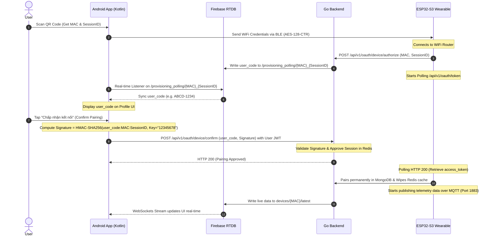

# Medical AI Chatbot (Sức Khỏe Việt AI)

A modern Android application providing AI-powered medical consultation and health companionship.

---

## 🚀 User Trial Guide

To experience all features of **Sức Khỏe Việt AI**, users can follow these steps:

1. **Onboarding**: Go through the onboarding screens to understand the core value of the application.
2. **Registration / Login**: Create a personal account (credentials are securely stored in the local database).
3. **AI Consultation**:
   - In the home screen, choose from **Suggested Questions** (e.g. "I have a headache and fever") or type symptoms directly.
   - Use the **Quick Replies** above the input bar to interact swiftly with the AI assistant.
4. **Triage Assessment & Classification**:
   - Observe color-coded urgency tags: **Green** (Home care), **Yellow** (Consult a doctor), **Red** (Emergency care).
   - Tap "Analysis by AI" to inspect predicted clinical details and symptoms.
5. **History Management**: Review previous threads in the **History** tab.
6. **Nearby Medical Facilities**: Use the map feature to locate the nearest hospitals, clinics, or pharmacies.

---

## ✨ Key Features

- **🤖 Smart AI Assistant:** Medical consultation powered by Google's Gemini AI (Firebase AI) providing natural, in-depth clinical advice.
- **🏥 Automated Triage Tagging:** Evaluates symptom urgency based on clinical protocols.
- **📋 Medical Record Summary:** Automatically summarizes dialog history so patients can easily present it to doctors.
- **📂 Consult History Management:** Stores health logs for users and their dependents.
- **📍 Location-based Map:** Integrates Google Maps/Location API to search for clinics, hospitals, and drugstores.
- **📱 Responsive UI/UX:** Built entirely with Jetpack Compose following Material 3 guidelines, fully adaptive across various screen sizes.

---

## 🏗️ Architecture: Clean Architecture + MVVM

The project is structured according to **Clean Architecture** principles combined with **MVVM** to ensure modularity, scalability, and testability.

### 1. Presentation Layer (UI & ViewModel)
- **Framework:** Jetpack Compose (Material 3).
- **Navigation:** Type-safe Compose Navigation.
- **State Management:** viewModels exposing StateFlows for reactive UI rendering.

### 2. Domain Layer (Business Logic)
- **Entities:** Core models such as `ChatThread`, `UserProfile`, `TriageTag`, and `IoTData`.
- **Use Cases:** Encapsulates business actions like `SendMessageUseCase`.

### 3. Data Layer (Implementation)
- **Repositories:** Coordinates data from Room (local cache), Firebase AI (Gemini), and Location services.
- **Data Sources:** Local Room Database, remote Firebase RTDB, and BleIoT Service.

---

## 📂 Directory Structure

```text
app/src/main/java/edu/hust/medicalaichatbot/
├── data/               # Data Layer (Repositories, Room DAOs, BLE services)
├── domain/             # Domain Layer (Business Entities & Use Cases)
├── ui/                 # Presentation Layer (Compose UI, ViewModels, Theme)
└── utils/              # Common Utilities & Constants
```

---

## 🛠️ Tech Stack

- **Language:** Kotlin 2.0+
- **UI Framework:** Jetpack Compose (Material 3)
- **Architecture:** Clean Architecture + MVVM
- **Database:** Room (with Paging 3 support)
- **AI Integration:** Firebase AI (Gemini API)
- **Networking:** Standard `java.net.HttpURLConnection` running in Coroutines (`Dispatchers.IO`)
- **IoT Provisioning:** Espressif BLE Provisioning SDK for Android
- **Event Bus:** GreenRobot EventBus
- **JVM Target:** 21

---

## ⚙️ Setup Requirements

- Android Studio Ladybug or newer.
- JDK 21.
- Firebase project with Gemini AI enabled.
- `google-services.json` placed in the `app/` directory.

---

## 🔗 Secure IoT Device Pairing (RFC 8628 Flow)

The application includes a secure device flow confirmation feature to pair hardware wearables (like the ESP32-S3 band) securely.

### Sequence Diagram



### Flow Breakdown

1. **BLE Setup:** The user scans the QR code on the physical band to capture the MAC address and session parameters. The phone connects locally via BLE (protected by Diffie-Hellman ECDH key agreement and AES-128-CTR) and transfers WiFi credentials.
2. **Device Registration:** The ESP32 joins WiFi and sends an authorization request to the Go backend, which inserts the session status (`authorization_pending`) into Redis and publishes a 4-letter user code to Firebase RTDB.
3. **App Confirmation:** The Android app listens to Firebase RTDB, receives the user code, and presents a confirmation card on the **Profile** screen.
4. **Cryptographic Validation:** Clicking "Confirm" initiates a secure POST request to the Go Backend containing the HMAC-SHA256 signature calculated using the default device PIN PoP (`12345678`) as a secret key, authenticated via the user's JWT.
5. **Completion:** Go Backend updates the pairing state to approved in Redis. The ESP32 retrieves its permanent access token and starts streaming telemetry data over MQTT, which is synced to the app's real-time charts via Firebase RTDB.
